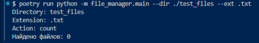
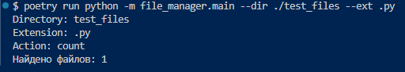

# 📁 File Manager

CLI (command line interface) - утилита для работы с файлами: подсчет, удаление, перемещение.

## Возможности

- Подсчет сколько файлов находится с заданным расширением в директории
- Удаление файлов с заданным расширением в директории
- Перемещение файлов с заданным расширением из одной директории в другую

## Как это выглядит




## Быстрый старт

1. Клонируй репозиторий:
```bash 
git clone https://github.com/GenaBukin1986/file-manager.git .
```
2. Установи зависимости
```bash
poetry install
```
3. Запусти
```bash
poetry run python -m file_manager.main --dir ./<ваша_директория> --ext <расширение_файла>
```
## Параментры
- --dir - путь к директории (обязательный)
- --ext - расширение файлов (обязательный)
- --action - действие: count (по умолчанию), delete, move
- --target - целевая директория для move (обязательный для move)
- --yes - пропустить подтверждение для автоматизации


```bash
# Подсчитать количество файлов с заданным расширением
poetry run python -m file_manager.main --dir ./test_files --ext .txt

# Удалить файлы с заданным расширением в директории
poetry run python -m file_manager.main --dir ./test_files --ext .py --action delete --yes

# Переместить файлы с заданным расширением из одной директории в другую
poetry run python -m file_manager.main --dir ./test_move --ext .pdf --action move --target ./backup --yes

# Справка по всем доступным командам
poetry run python -m file_manager.main --help
```
## Технологии

- Python 3.11
- pathlib (стандартная библиотека)
- argparse (стандартная библиотека)

## Лицензии

MIT © 2026 [Миша Кукушкин](https://github.com/GenaBukin1986/file-manager)